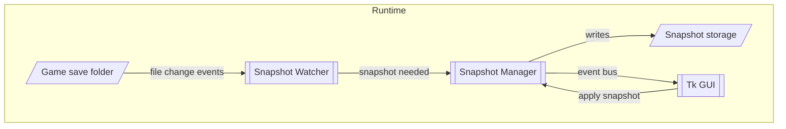

# Hades II Save Manager – Design Document

A **Python desktop tool** that captures, browses and restores snapshots of Hades II save files.  
Level of detail: *moderate* – we fix the UI framework (Tkinter) and lay out the key modules, data-flow and algorithms so implementation can start quickly.

---

## 1. Main Features

* **Auto-snapshot** whenever the player enters a new room (detected by file change).  
* **Screenshot capture** alongside each snapshot to visualise the room.  
* **Snapshot browser**  
  * Carousel widget to flip through recent snapshots.  
  * List / table view with bulk-delete.  
* **Manual controls**  
  * Toggle *Auto* on / off.  
  * “Take snapshot now” button.  
* **Settings dialog** – choose game save folder and snapshot destination.  
* **Profile awareness** – Hades II has four profiles; snapshots are stored per profile to avoid overwrite.  
* **Restore** – close game → copy snapshot files over live save files → restart game. If the game is still open, warn the user.

---

## 2. Technology Choices

| Concern            | Decision | Reason |
|--------------------|----------|--------|
| UI framework       | **Tkinter** (stdlib) | No extra runtime, easy packaging, sufficient widgets (Canvas, Listbox, ttk). |
| File-system watch  | **watchdog** | High-level cross-platform observer API. |
| Screenshots        | **Pillow** + **pyautogui.screenshot** (or `mss`) | Simple capture of full screen; crop not required. |
| Process check      | **psutil** | Detect if `HadesII.exe` is running before restore. |
| Packaging          | **PyInstaller** | Generate self-contained executable for Windows. |

---

## 3. Directory Layout (proposed)

```
hades2_save_manager/
├── gui/                    # Tkinter windows & widgets
│   ├── main_window.py
│   ├── snapshot_carousel.py
│   ├── snapshot_list.py
│   └── settings_dialog.py
├── services/
│   ├── snapshot_watcher.py # watchdog Observer logic
│   ├── snapshot_manager.py # create / delete / apply snapshots
│   └── screen_capture.py   # take screenshots
├── utils/
│   ├── file_ops.py         # safe copy / delete helpers
│   └── time_helpers.py
├── resources/              # Icons, default config JSON
└── main.py                 # app entry-point
```

---

## 4. High-Level Data Flow



---

## 5. Snapshot Algorithm

1. **Monitor** `%USERPROFILE%/Saved Games/Hades II` recursively.  
2. On first write event for any `.sav` / `_Temp.sav` file:  
   * If `now - last_snapshot_ts > 5 s` ⇒ create new snapshot folder `YYYY-MM-DD_HH-MM-SS_profileN`.  
   * Else **overwrite** files inside the last snapshot (same “room”).  
3. Copy:  
   * `Profile{N}.sav`, `Profile{N}_Temp.sav`, all `Profile{N}.sav.bak*`.  
4. Capture screenshot → `snapshot.png` in same folder.  
5. Emit “snapshot_created” event to GUI for live refresh.

---

## 6. GUI Overview

| Window / Widget | Purpose |
|-----------------|---------|
| **MainWindow**  | Root `Tk`; contains toolbar, carousel, list. |
| **SnapshotCarousel** | Horizontal scrollable thumbnails (screenshots). Click to select. |
| **SnapshotList** | `ttk.Treeview` with date, room, size; supports multi-select delete. |
| **SettingsDialog** | `tk.Toplevel`; fields for *Save folder*, *Snapshot folder*, *Auto-snapshot* tick; persists to `settings.json`. |
| **StatusBar**   | Shows current profile, auto-snapshot state and last action. |

---

## 7. Profile Management

* Detect profile number from changed file path (`Profile1.sav`, etc.).  
* Store snapshots under `Snapshots/Profile{N}/...`.  
* Carousel & list filter by selected profile (combo box in toolbar).

---

## 8. Error Handling & Concurrency

* Use `queue.Queue` to push watcher events → GUI thread (`after()` loop) to avoid Tk threading issues.  
* Wrap file ops with `try/except`; show `messagebox` on failure.  
* During restore:  
  * Call `psutil.process_iter` to detect `HadesII.exe`; abort with warning if running.  
  * Backup current live saves to `live_backup/` before overwrite.

---

## 9. Getting Started

```bash
# create venv & install
python -m venv .venv
.venv\Scripts\activate
pip install watchdog pillow pyautogui psutil

# run
python -m hades2_save_manager.main
```

**Build executable**

```bash
pyinstaller --onefile --noconsole --add-data "resources;resources" hades2_save_manager/main.py
```

---

## 10. Future Enhancements

* Cloud sync of snapshots (e.g. OneDrive).  
* Tag / annotate snapshots.  
* Dark-mode styling using `ttkbootstrap`.
